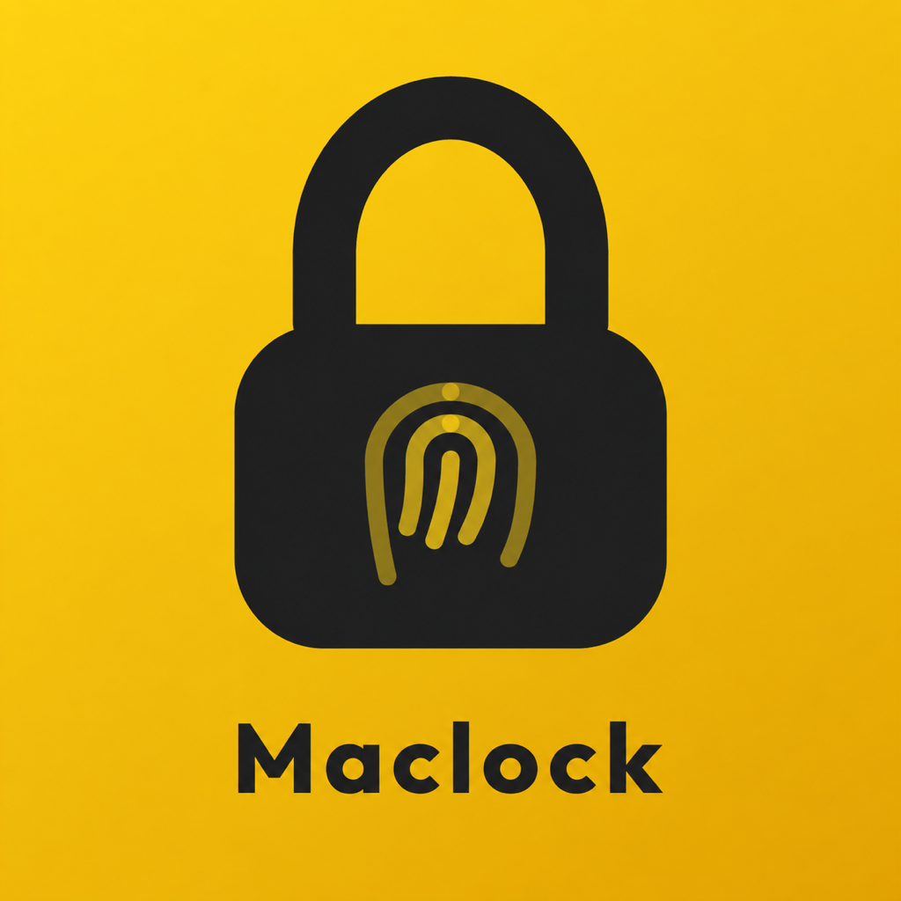
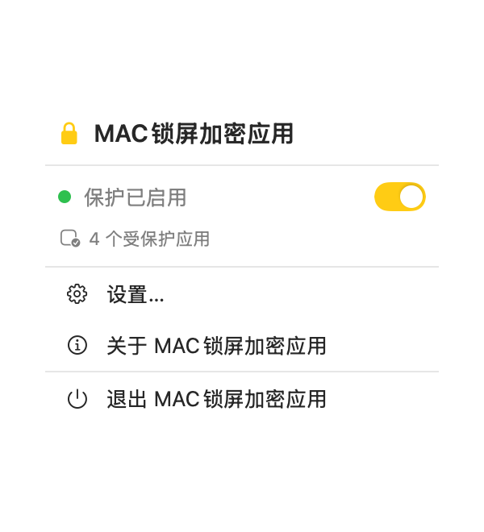
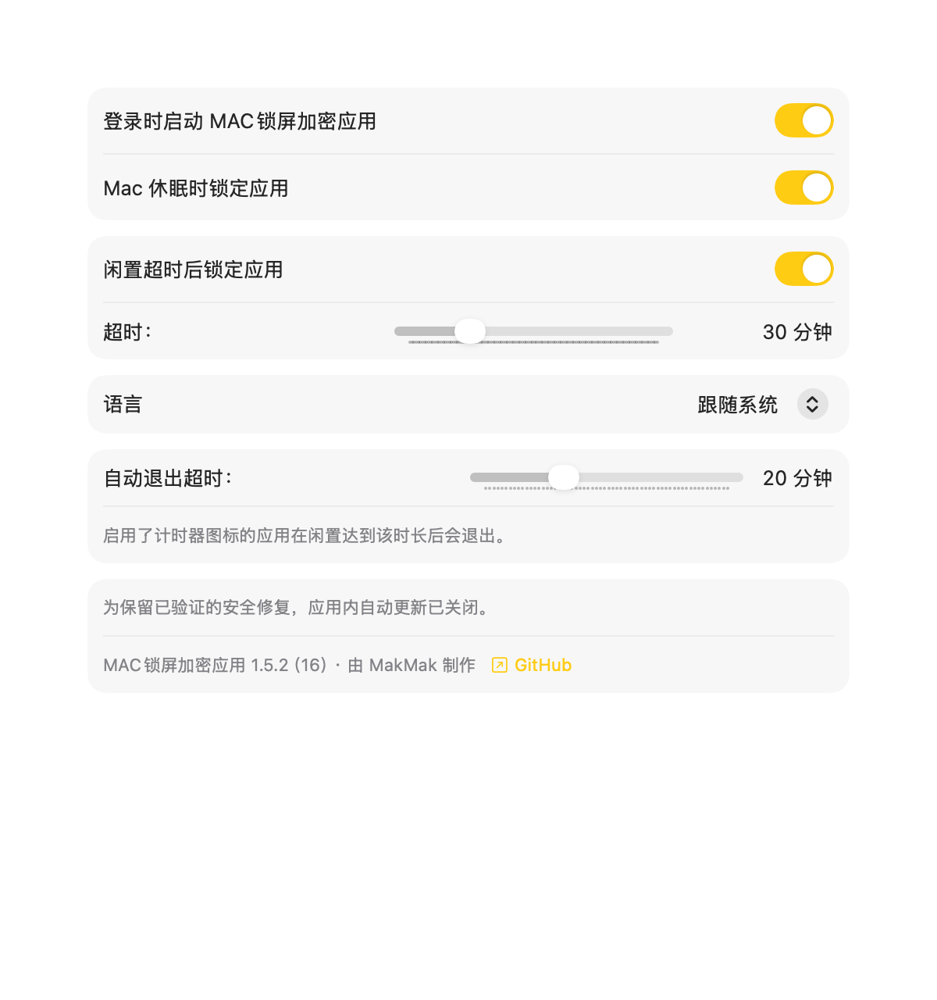
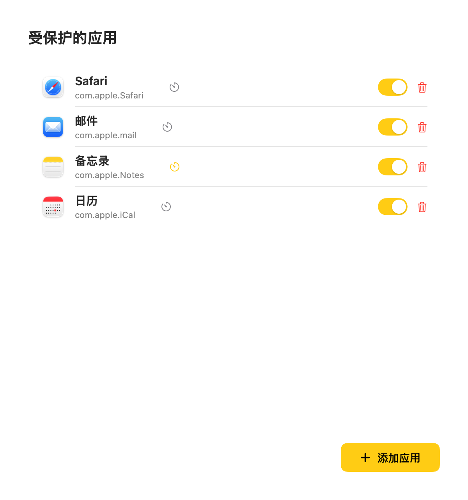
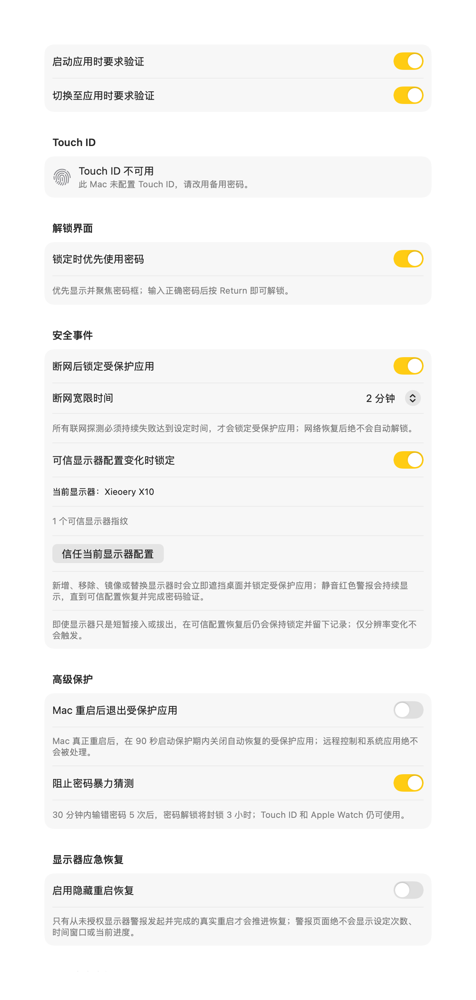
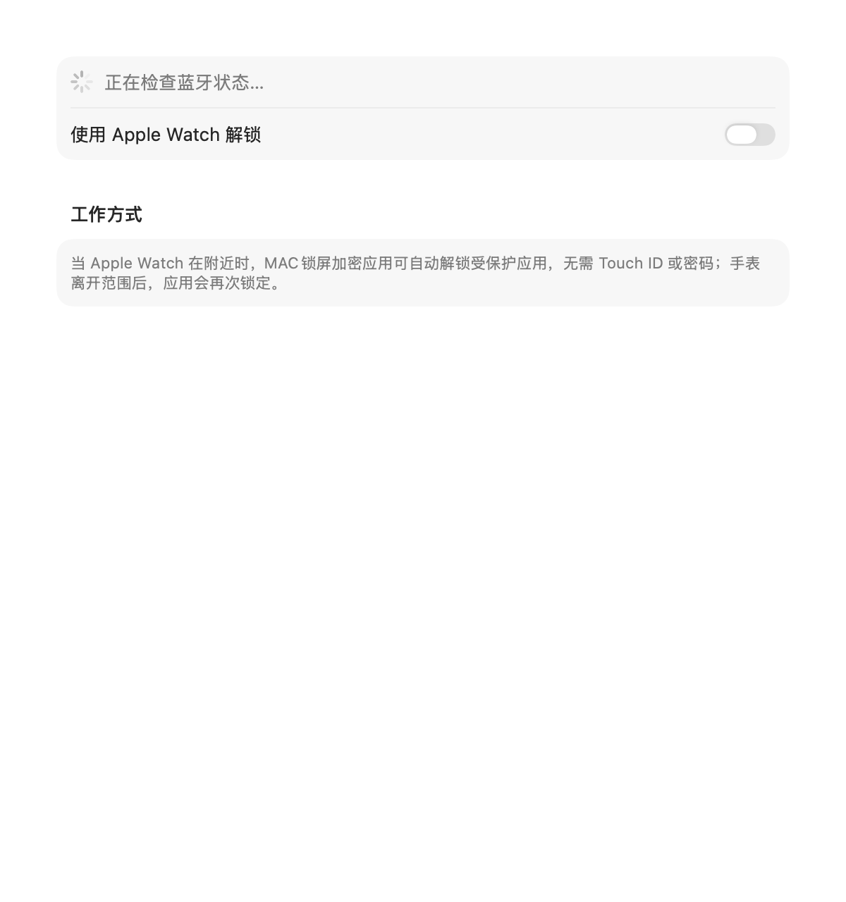
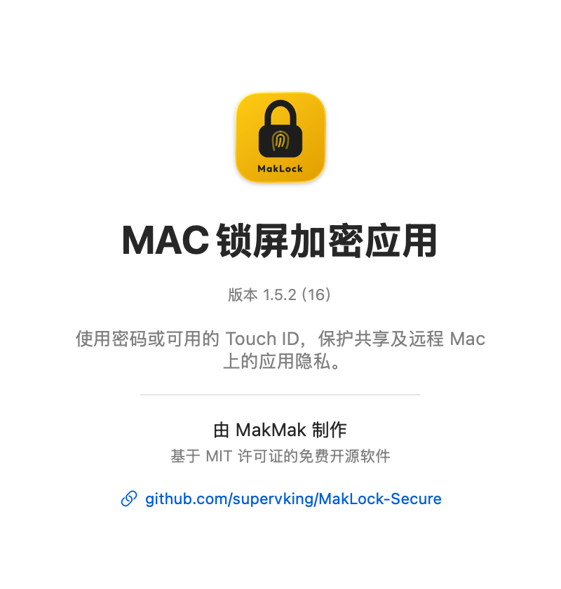
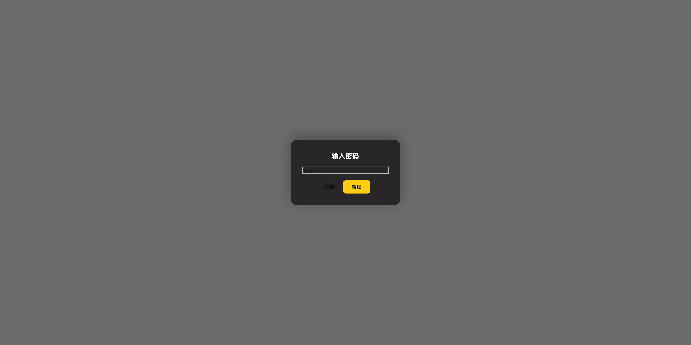
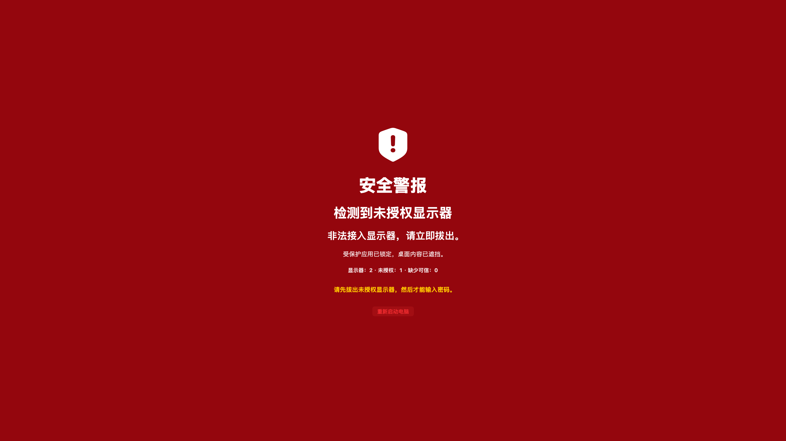

<p align="center">
  
</p>

<h1 align="center">MAC锁屏加密应用</h1>

<p align="center">
  Maclock Secure MacOS｜面向远程电脑防偷窥与隐私保护的开源 macOS 应用锁
</p>

<p align="center">
  简体中文 · <a href="README.md">English</a>
</p>

<p align="center">
  
  
  <a href="LICENSE"></a>
  <a href="https://github.com/supervking/MakLock-Secure/releases/latest"></a>
  <a href="https://github.com/supervking/MakLock-Secure/releases"></a>
</p>

适用于查找 **Mac锁屏、macOS应用锁、Mac应用加密、应用程序加锁、远程电脑防偷窥、远程办公隐私保护、显示器防窥** 方案的用户。

## 下载

下载适用于 macOS 13 及以上版本的 [Maclock Secure MacOS 1.5.3](https://github.com/supervking/MakLock-Secure/releases/tag/v1.5.3)：

- [通用版 DMG](https://github.com/supervking/MakLock-Secure/releases/download/v1.5.3/Maclock-Secure-MacOS-1.5.3-universal.dmg)——推荐的拖拽安装包
- [通用版 ZIP](https://github.com/supervking/MakLock-Secure/releases/download/v1.5.3/Maclock-Secure-MacOS-1.5.3-universal.zip)——备用压缩包
- 两个安装包都附带独立 SHA-256 校验文件

发布包同时支持 Apple Silicon 和 Intel Mac，采用 ad-hoc 本地签名，尚未经过 Apple 公证。打开前请核对 SHA-256；首次运行时，macOS 可能要求在“系统设置 → 隐私与安全性”中确认打开。

## 这是什么软件？

MAC锁屏加密应用可为当前 macOS 账户中的指定应用增加独立认证锁定层。当受保护应用启动、切换到前台，或电脑进入设定的风险状态时，应用内容会被全屏遮挡，必须通过应用备用密码、可用的 Touch ID 或已配置的 Apple Watch 才能恢复访问。

它特别适合长期保持登录状态的 Mac mini、远程办公电脑、共享 Mac 和无人值守工作站。

## 远程电脑防偷窥与隐私保护

| 远程使用场景 | 实际保护行为 |
|---|---|
| 现场人员打开聊天、浏览器、通讯或管理应用 | 全屏锁定层遮住内容并要求独立认证 |
| RustDesk 等远程连接中断 | 可在所有网络探测持续失败一段时间后锁定受保护应用 |
| 远程电脑长时间无人操作 | 达到闲置时间后自动锁定，指定应用也可选择自动关闭 |
| 有人接入、替换或镜像显示器 | 立即遮挡桌面，并持续显示红色所有者认证警报 |
| 显示器快速接入后马上拔出 | 即使显示器结构已经恢复，事件仍会锁存并保留安全记录 |
| 远程控制重新连接或屏幕重新唤醒 | 密码框重新获得焦点，避免按键落入被保护应用 |
| Mac mini 没有 Touch ID 键盘 | 自动使用密码流程，不会因为缺少指纹设备而失去解锁入口 |

### 推荐的远程电脑配置

1. 为聊天、浏览器、密码、通讯和服务器管理应用分别启用保护。
2. 开启“锁定时优先使用密码”，便于纯键盘和远程控制操作。
3. 开启断网保护，并根据网络稳定性选择 1、2 或 5 分钟延迟。
4. 将当前显示器登记为可信显示器，再启用显示器结构变化保护。
5. 设置合适的闲置锁定时间，并为高敏感应用决定是否自动关闭。
6. 妥善保管应用备用密码；不要把远程控制密码与应用密码设为同一密码。

### 隐私保护边界

本软件保护的是当前已登录 macOS 账户内的应用可见内容，不会加密 RustDesk 或其他远程控制协议，也不承诺阻止拥有管理员、Root 或系统录屏权限的人。它不能替代 FileVault、独立 macOS 用户、系统锁屏、远程控制账号安全和现场物理管理。

## 当前功能

### 应用认证与锁定

- 应用启动和切换到前台时分别要求认证
- 密码优先锁定界面，密码框自动聚焦，按 Return 提交
- macOS 实际提供可用生物识别硬件时支持 Touch ID
- 可选 Apple Watch 接近解锁及佩戴状态判断
- 所有显示器上的全屏遮挡层
- 原生 AppKit 安全密码输入与真实第一响应者检查
- 可在主可信显示器的锁屏中通过 Mac 所有者认证重置应用密码
- Keychain 访问异常会单独提示，不会计为密码错误
- macOS 系统认证中断后会恢复锁屏输入，无需重新启动电脑
- 正式版本不存在开发跳过按钮或全局解除锁定快捷键

### 远程、闲置与会话保护

- 1 分钟至 2 小时闲置锁定
- Mac 睡眠或 Apple Watch 离开范围时锁定
- 可为指定应用启用闲置后自动关闭
- 所有联网探测连续失败 1、2 或 5 分钟后锁定
- 网络恢复不会自动解锁应用
- 远程控制重连、屏幕唤醒和会话焦点变化后恢复密码输入

### 显示器防窥与应急恢复

- 检测普通的显示器新增、拔除、替换、镜像和取消镜像
- 结构变化时先立即遮挡桌面，再显示持续红色警报、静音通知和红色菜单栏状态
- 快速接入再拔出仍会锁存，不能靠拔线清除警报
- 分辨率、刷新率、显示器睡眠和桌面尺寸变化不进入结构篡改警报
- 所有者可配置隐藏应急重启恢复；完整验证后只绕过当前 Boot 的显示器警报，受保护应用仍保持关闭和独立认证
- 可选真实重启后的单次 90 秒恢复应用清理

### 本机状态与安全记录

- 备用密码和密码错误限制保存在 macOS Keychain
- 密码错误依次限制 2 秒、4 秒、30 秒和 5 分钟
- 30 分钟内第五次错误后封锁密码解锁 3 小时
- 非敏感安全事件只保留最近 12 小时，最多 200 条
- English 与简体中文界面，可在应用内切换语言

## 应用页面截图

以下图片来自实际 Release 界面，不包含开发跳过按钮、密码、个人账号或私有配置。

### 菜单栏



### 通用设置



### 受保护应用



### 安全性设置



### Apple Watch



### 关于



### 密码锁定界面



### 未授权显示器警报



## 安装步骤

1. 下载最新版 DMG 和对应的 `.sha256` 文件。
2. 核对安装包 SHA-256。
3. 打开 DMG，将 `MakLock.app` 拖入“应用程序”。
4. 如果 macOS 阻止首次打开，请到“系统设置 → 隐私与安全性”确认。
5. 首先设置应用备用密码，再添加需要保护的应用。

## 兼容性

- macOS 13 或更新版本
- Apple Silicon 与 Intel Mac
- Touch ID 不是必需条件；桌面 Mac 需要另行配对兼容的 Touch ID 键盘
- Apple Watch 为可选功能
- 不需要云账号或订阅

## 从源码构建

```bash
git clone https://github.com/supervking/MakLock-Secure.git
cd MakLock-Secure
xcodebuild -project MakLock.xcodeproj -scheme MakLock -configuration Release CODE_SIGNING_ALLOWED=NO build
```

需要 Xcode 15 或更新版本。为保持配置、Keychain 和升级兼容性，稳定 Bundle ID 继续使用 `com.makmak.MakLock`。

## 致谢与许可证

本独立维护版本基于 Maciej Dutkiewicz 的原始 [MakLock 项目](https://github.com/dutkiewiczmaciej/MakLock)。原始版权声明与 [MIT 许可证](LICENSE) 均已保留。
